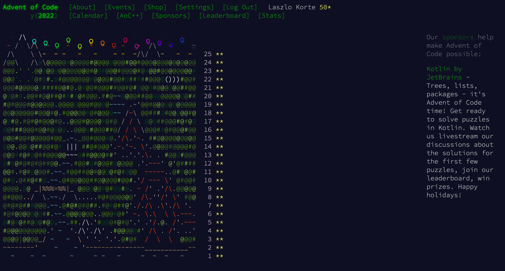

# Solutions for Advent of Code 2022 in Rust

This year is the first time I tried to complete the [Advent of Code](//adventofcode.com) challange.
I took the opportunity to learn a little Rust. As I had not used Rust before the excellent videos of [chris biscardi](https://www.youtube.com/@chrisbiscardi/videos) were a great help to get everything up and running.

